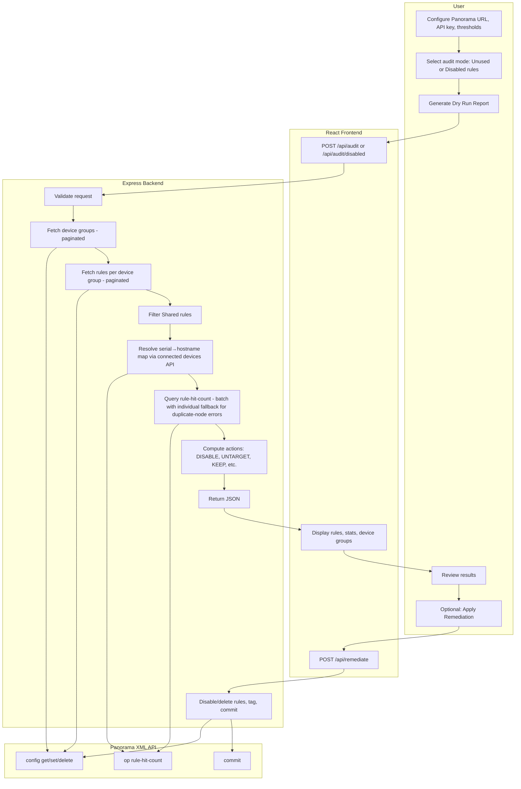

# Palo Alto Panorama Rule Auditor

A comprehensive web application for auditing, analyzing, and managing firewall rules in Palo Alto Networks Panorama deployments. Identify unused rules, manage disabled rules, and automate remediation with confidence through detailed dry-run reports.

## Table of Contents

- [Overview](#overview)
- [Features](#features)
- [Prerequisites](#prerequisites)
- [Installation](#installation)
- [Configuration](#configuration)
- [Architecture & Data Flow](#architecture--data-flow)
- [Usage Guide](#usage-guide)
- [Audit Modes](#audit-modes)
- [Remediation Options](#remediation-options)
- [Export & Reporting](#export--reporting)
- [High Availability (HA) Pair Support](#high-availability-ha-pair-support)
- [API Reference](#api-reference)
- [Troubleshooting](#troubleshooting)
- [Security Considerations](#security-considerations)
- [Additional Documentation](#additional-documentation)

## Overview

Palo Alto Panorama Rule Auditor helps network administrators:

- **Identify unused firewall rules** that haven't been hit in a specified number of days
- **Find disabled rules** that have been disabled for extended periods
- **Analyze rule usage patterns** across device groups and managed firewalls
- **Automate remediation** with production mode for disabling or deleting rules
- **Generate comprehensive reports** in PDF format for documentation and compliance

The application provides a modern web interface with dry-run capabilities, ensuring you can review all changes before applying them to your Panorama configuration.

## Features

### Core Functionality

- **Dual Audit Modes**
  - **Find Unused Rules**: Identifies rules with no hits within a configurable threshold (default: 90 days)
  - **Find Disabled Rules**: Locates rules that have been disabled for more than a specified period

- **Production & Dry-Run Modes**
  - **Dry-Run Mode**: Generate reports without making any changes to Panorama
  - **Production Mode**: Apply remediation actions (disable/delete rules) with automatic tagging and commit

- **Selective Remediation**
  - Checkbox selection for individual rules
  - All rules selected by default (can be unchecked)
  - Bulk operations with visual feedback

- **Comprehensive Reporting**
  - Real-time audit summaries with statistics
  - Detailed rule listings with hit counts and timestamps
  - Device group discovery and display
  - PDF export with full audit details

- **High Availability Support**
  - HA pair definition via text file upload
  - Intelligent rule evaluation (both firewalls must show 0 hits for remediation)
  - Visual HA pair grouping in rule display

- **Rule Protection**
  - Rules with "PROTECT" tag are automatically excluded from disable/delete operations
  - Protected rules are marked with "PROTECTED" action in audit reports
  - Visual indication in UI with purple badge

- **Device Group Management**
  - Automatic discovery of all device groups
  - Pre-rulebase security rule analysis
  - Shared device group filtering (automatically ignored)

### Technical Features

- **Modern Web Interface**: Built with React and TailwindCSS
- **RESTful API**: Express.js backend with TypeScript
- **XML API Integration**: Direct integration with Panorama XML API
- **Real-time Status**: Live progress indicators and status updates
- **Error Handling**: Comprehensive error reporting and logging
- **Responsive Design**: Works on desktop and tablet devices

## Prerequisites

- **Node.js**: Version 18 or higher
- **Palo Alto Panorama**: Accessible via HTTPS with XML API enabled
- **Panorama API Key**: Valid API key with appropriate permissions
- **Network Access**: Ability to reach Panorama management interface from the application server

### Required Panorama Permissions

The API key must have permissions to:
- Read device group configurations
- Read security rule configurations
- Query operational data (rule-hit-count)
- Modify security rules (for production mode)
- Create and manage tags (for production mode)
- Commit configuration changes (for production mode)

## Installation

### Docker Installation (Recommended)

For the easiest deployment, use Docker:

1. **Clone the repository:**
   ```bash
   git clone https://github.com/gsk-panda/PaloRuleAuditorv2.git
   cd PaloRuleAuditor
   ```

2. **Create environment file** (`.env`):
   ```bash
   cp .env.example .env
   # Edit .env and set your API keys
   ```

3. **Start with Docker Compose:**
   ```bash
   docker-compose up -d
   ```

4. **Access the application:**
   - Open `http://localhost:3010` in your browser

For detailed Docker setup instructions, environment variable configuration, and troubleshooting, see **[DOCKER_SETUP.md](DOCKER_SETUP.md)**.

### Updating an Existing Installation

If you already have PaloRuleAuditor installed and want to update to the latest version:

**Quick Update (Recommended):**
```bash
# Stop the service
sudo systemctl stop panoruleauditor

# Update from git
cd /opt/PaloRuleAuditor
sudo -u panoruleauditor git pull origin main

# Install any new dependencies
sudo -u panoruleauditor npm install

# Rebuild if needed
sudo -u panoruleauditor npm run build

# Start the service
sudo systemctl start panoruleauditor
```

For detailed update instructions, troubleshooting, and rollback procedures, see **[DEPLOYMENT_UPDATE.md](DEPLOYMENT_UPDATE.md)**.

### Development Installation

1. **Clone the repository:**
   ```bash
   git clone https://github.com/gsk-panda/PaloRuleAuditorv2.git
   cd PaloRuleAuditor
   ```

2. **Install dependencies:**
   ```bash
   npm install
   ```

3. **Start the development server:**
   ```bash
   npm run dev
   ```

   This starts both the frontend (Vite) on `http://localhost:3000` and the backend (Express) on `http://localhost:3010`.

### Production Installation (RHEL 9)

#### Standalone Installation

For production deployment on RHEL 9 with standalone service, use:

```bash
sudo ./install-rhel9.sh
```

The script will:
- Create a dedicated system user (`panoruleauditor`)
- Set up the application in `/opt/PaloRuleAuditor`
- Configure systemd service for automatic startup
- Set up proper file permissions
- Configure the application to run on system boot

After installation, manage the service with:

```bash
# Start the service
sudo systemctl start panoruleauditor

# Stop the service
sudo systemctl stop panoruleauditor

# Restart the service
sudo systemctl restart panoruleauditor

# Check status
sudo systemctl status panoruleauditor

# View logs
sudo journalctl -u panoruleauditor -f
```

#### Apache Installation

For deployment behind Apache (e.g., at `https://panovision.sncorp.com/audit`), use:

```bash
sudo ./install-apache-rhel9.sh
```

The script will:
- Install and configure Apache HTTP Server
- Create a dedicated system user (`panoruleauditor`)
- Set up the application in `/opt/PaloRuleAuditor`
- Build the frontend and deploy to `/var/www/html/audit`
- Configure backend as a systemd service on port 3010
- **Prompt for Panorama URL and API key** and store in `/opt/PaloRuleAuditor/.config`
- Create Apache virtual host configuration
- Set up proxy rules for API calls

**During installation, you will be prompted for:**
- Panorama URL (e.g., `https://panorama.example.com`)
- Panorama API Key

These values are stored securely in `/opt/PaloRuleAuditor/.config` and can be updated later.

#### Apache Installation with SAML Authentication

For deployment with SAML authentication (e.g., at `https://panovision.sncorp.com/audit`), use:

```bash
sudo chmod +x install-saml-apache.sh
sudo ./install-saml-apache.sh
```

This script will:
- Run the base Apache installation
- Install and configure `mod_auth_mellon` for SAML authentication
- Generate Service Provider (SP) metadata
- Prompt for Identity Provider (IdP) metadata
- Configure Apache with SAML protection for all `/audit` paths
- Set up user attribute mapping (username, email, displayName)

**For complete SAML setup instructions, see [SAML_DEPLOYMENT_GUIDE.md](SAML_DEPLOYMENT_GUIDE.md)**

After installation:

```bash
# Start the backend service
sudo systemctl start panoruleauditor-backend

# Enable backend auto-start
sudo systemctl enable panoruleauditor-backend

# Restart Apache
sudo systemctl restart httpd

# Check backend status
sudo systemctl status panoruleauditor-backend

# View backend logs
sudo journalctl -u panoruleauditor-backend -f

# View Apache logs
sudo tail -f /var/log/httpd/panoruleauditor_*.log
```

**To update Panorama configuration:**
1. Edit `/opt/PaloRuleAuditor/.config`
2. Restart the backend: `sudo systemctl restart panoruleauditor-backend`

**Note:** The frontend will automatically load stored Panorama URL and API key from the backend configuration endpoint on first load.

## Configuration

### Panorama Connection Settings

Access the application and configure:

1. **Panorama URL**: The HTTPS URL of your Panorama management interface
   - Example: `https://panorama.example.com`
   - Must be accessible from the application server

2. **API Key**: Your Panorama XML API key
   - Generate in Panorama: **Device** → **Setup** → **Management** → **XML API Setup**
   - Ensure the key has appropriate permissions (see Prerequisites)

3. **Unused Threshold (Days)**: Number of days of inactivity to consider a rule unused
   - Default: 90 days
   - Only applies to "Find Unused Rules" mode

4. **Disabled Threshold (Days)**: Number of days a rule must be disabled to appear in results
   - Default: 90 days
   - Only applies to "Find Disabled Rules" mode

### HA Pairs Configuration

For "Find Unused Rules" mode, you can upload a text file defining High Availability pairs:

**File Format:**
```
firewall1:firewall2
fw-primary:fw-secondary
pa-01:pa-02
```

**Rules:**
- One pair per line
- Format: `firewall1:firewall2`
- Both firewalls in a pair must show 0 hits for a rule to be eligible for remediation
- Rules are visually grouped by HA pair in the results table

### Optional SSH Configuration

The audit can use SSH to fetch rule hit counts instead of the Panorama XML API, which is faster for large deployments. SSH is **optional**; if not configured, the application uses the API only.

**SSH requires both:**
1. **Username** – `PANORAMA_SSH_USER`
2. **Authentication** – either:
   - `PANORAMA_SSH_PRIVATE_KEY` or `PANORAMA_SSH_PRIVATE_KEY_PATH` (key-based auth), or
   - `PANORAMA_SSH_PASSWORD` (password auth)

If username or both auth options are missing, SSH is disabled and the audit uses the Panorama API.

**Encrypted keys:** If your private key has a passphrase, set `PANORAMA_SSH_KEY_PASSPHRASE` in `.config` or env.

**Environment variables:**
```
PANORAMA_SSH_USER="admin"
PANORAMA_SSH_PRIVATE_KEY_PATH="/path/to/id_rsa"
```

or:
```
PANORAMA_SSH_USER="admin"
PANORAMA_SSH_PASSWORD="your-password"
```

**`.config` file** (same keys):
```
PANORAMA_SSH_USER="admin"
PANORAMA_SSH_PRIVATE_KEY_PATH="/path/to/id_rsa"
```

Optional: `PANORAMA_SSH_HOST` (defaults to hostname from Panorama URL), `PANORAMA_SSH_PORT` (default 22).

## Architecture & Data Flow

### How It Works (Flowchart)



### System Architecture

The application follows a client-server architecture:

```
┌─────────────────┐         ┌──────────────────┐         ┌─────────────────┐
│   React Client  │ ◄─────► │  Express Server  │ ◄─────► │  Panorama API   │
│   (Port 3000)   │  HTTP   │   (Port 3010)    │  HTTPS  │   (External)    │
└─────────────────┘         └──────────────────┘         └─────────────────┘
         │                           │
         │                           │
         ▼                           ▼
┌─────────────────┐         ┌──────────────────┐
│  TailwindCSS UI │         │  TypeScript      │
│  State Mgmt     │         │  XML Parser      │
│  PDF Export     │         │  Rule Processing │
└─────────────────┘         └──────────────────┘
```

### Complete Data Flow: Find Unused Rules

#### Phase 1: User Input & Request Initiation

1. **User Interface (App.tsx)**
   - User enters Panorama URL, API key, and threshold days
   - User optionally uploads HA pairs file (parsed client-side)
   - User clicks "Generate Dry Run Report"
   - `handleAudit()` function is triggered

2. **Frontend Request Preparation**
   ```typescript
   POST /api/audit
   {
     url: "https://panorama.example.com",
     apiKey: "user_provided_key",
     unusedDays: 90,
     haPairs: [{fw1: "fw1", fw2: "fw2"}, ...]
   }
   ```

#### Phase 2: Backend Processing (server/index.ts)

3. **Request Reception**
   - Express receives POST request at `/api/audit`
   - Validates required parameters (url, apiKey)
   - Extracts `unusedDays` (defaults to 90) and `haPairs` array

4. **Service Invocation**
   - Calls `auditPanoramaRules(panoramaUrl, apiKey, unusedDays, haPairs)`
   - Passes control to `panoramaService.ts`

#### Phase 3: Panorama API Interaction (server/panoramaService.ts)

5. **Device Group Discovery**
   ```
   API Call: GET /api/?type=config&action=get
   XPath: /config/devices/entry[@name='localhost.localdomain']/device-group
   
   Response Structure:
   <response>
     <result>
       <device-group>
         <entry name="device-group-1"/>
         <entry name="device-group-2"/>
       </device-group>
     </result>
   </response>
   ```
   - Parses XML response using `fast-xml-parser`
   - Extracts device group names into array
   - Filters out "Shared" device group if present

6. **Rule Discovery Loop** (for each device group)
   ```
   API Call: GET /api/?type=config&action=get
   XPath: /config/devices/entry[@name='localhost.localdomain']/
          device-group/entry[@name='{dgName}']/pre-rulebase/security/rules
   
   Response Structure:
   <response>
     <result>
       <rules>
         <entry name="Rule Name 1">
           <disabled>no</disabled>
           <target>
             <devices>
               <entry name="firewall1"/>
             </devices>
           </target>
         </entry>
       </rules>
     </result>
   </response>
   ```
   - Fetches all pre-rulebase security rules for device group
   - Filters out rules where `<disabled>yes</disabled>`
   - Extracts rule names and target information
   - Builds initial rule map with device group association

7. **Shared Rules Filtering**
   ```
   API Call: GET /api/?type=config&action=get
   XPath: /config/shared/pre-rulebase/security/rules
   ```
   - Fetches all Shared device group rule names
   - Creates set of Shared rule names
   - Filters out any device group rules with matching names

8. **Device Hostname Resolution**

   Before querying hit counts, the backend resolves serial numbers to human-readable hostnames:
   ```
   API Call: GET /api/?type=op&cmd=<show><devices><connected/></devices></show>&key={apiKey}
   ```
   - Parses the returned device list to build a `Map<serial, hostname>` (e.g., `"011901012320" → "midtown-place-fw1"`)
   - **Important**: `fast-xml-parser` strips leading zeros from numeric strings, so serial `"011901012320"` becomes integer `11901012320`. Both the padded (12-digit) and unpadded forms are stored as keys so lookups succeed regardless of which form appears in other API responses.
   - The resolved `hostname` is stored as `FirewallTarget.displayName` for display only; `FirewallTarget.name` always holds the raw serial number for Panorama write operations.

9. **Rule Hit Count Query** (batch strategy with individual fallback)
   ```
   API Call: GET /api/?type=op&cmd={xmlCommand}&key={apiKey}

   XML Command (batch — multiple rules per request):
   <show>
     <rule-hit-count>
       <device-group>
         <entry name="{dgName}">
           <pre-rulebase>
             <entry name="security">
               <rules>
                 <rule-name>
                   <entry name="{ruleName1}"/>
                   <entry name="{ruleName2}"/>
                   ...
                 </rule-name>
               </rules>
             </entry>
           </pre-rulebase>
         </entry>
       </device-group>
     </rule-hit-count>
   </show>

   Response Structure (per device-vsys entry):
   <response>
     <result>
       <rule-hit-count>
         <device-group>
           <entry name="{dgName}">
             <pre-rulebase>
               <entry name="security">
                 <rules>
                   <entry name="{ruleName}">
                     <device-vsys>
                       <entry name="{dgName}/{serial}/vsys1">
                         <hit-count>12345</hit-count>
                         <last-hit-timestamp>1768691213</last-hit-timestamp>
                         <rule-creation-timestamp>1710000000</rule-creation-timestamp>
                       </entry>
                       <entry name="{dgName}/{serial2}/vsys1">
                         <hit-count>0</hit-count>
                         <last-hit-timestamp>0</last-hit-timestamp>
                         <rule-creation-timestamp>1710000000</rule-creation-timestamp>
                       </entry>
                     </device-vsys>
                   </entry>
                 </rules>
               </entry>
             </pre-rulebase>
           </entry>
         </device-group>
       </rule-hit-count>
     </result>
   </response>
   ```

   **Batch Strategy & Duplicate-Node Fallback:**
   - Rules are initially queried in batches (multiple `<entry>` elements within `<rule-name>`)
   - Panorama may reject a batch with `status="error"` and the message `"[ruleName] is a duplicate node"` for certain device groups. This is a Panorama API limitation — it does **not** mean the rule name is duplicated in the config.
   - When a duplicate-node error occurs, the offending rule is removed from the batch and added to a `skippedDuplicates` set. The batch is retried without that rule. This loop continues until the batch succeeds or all rules have been removed.
   - After the retry loop, any rules remaining in `skippedDuplicates` are queried **one at a time** (a single `<entry>` per API call). This always succeeds.
   - Handles nested `device-vsys` entries — the entry name is formatted as `{dgName}/{serial}/vsys1`; the serial is extracted and used to look up the hostname.
   - Extracts `hit-count`, `last-hit-timestamp`, and `rule-creation-timestamp` for each device-vsys entry.
   - **Timestamp fallback**: If `last-hit-timestamp` is `0` or missing (rule never hit), `rule-creation-timestamp` is used as the date reference for threshold comparison. `rule-modification-timestamp` is **not** used (it changes too frequently to be a reliable reference).

10. **Target Processing & HA Pair Mapping**
    - For each rule, processes target information:
      - Extracts firewall serial numbers from `<target><devices><entry>` in the rule config
      - Resolves each serial to a hostname via the hostname map built in Step 8
      - Maps HA pairs using the provided HA pairs file (HA pair definitions use hostnames)
      - Creates `FirewallTarget` objects with:
        - `name`: Serial number (used for Panorama config write operations)
        - `displayName`: Resolved hostname (used for display only — may be `undefined` if resolution fails)
        - `hasHits`: Boolean (hit-count > 0)
        - `hitCount`: Numeric hit count
        - `haPartner`: Partner serial number (if in HA pair)
        - `lastHitDate`: Per-target ISO timestamp (used for per-target threshold comparison)

11. **Rule Action Determination**
    ```typescript
    For each rule:
      - Initialize firewallsToUntarget Set
      - For each target:
        - If target has HA partner:
          - Check if either partner has hits within threshold
          - If either has hits → protect both (don't add to untarget set)
          - If both have 0 hits or both last-hit before threshold → add both to untarget set
        - Else (non-HA target):
          - Per-target lastHitDate compared against unusedThreshold
          - If unused (lastHitDate < threshold) → add to untarget set

      - Determine action:
        - If ALL targets in untarget set → action = "DISABLE"
        - If SOME targets in untarget set → action = "UNTARGET"
        - If HA pair protected (either has recent hits) → action = "HA-PROTECTED"
        - Otherwise → action = "KEEP"
    ```

12. **Date Threshold Evaluation**
    - Calculates `unusedThreshold` date: `now - unusedDays`
    - **Per-target comparison**: Each `FirewallTarget.lastHitDate` is individually compared against the threshold. A target is considered unused if its last hit date is before the threshold — regardless of whether the rule has non-zero total hits on other devices.
    - **Timestamp fallback chain** (per device-vsys entry):
      1. `last-hit-timestamp` if hit count > 0 on that device
      2. `rule-creation-timestamp` if last-hit-timestamp is 0 or missing
      3. (`rule-modification-timestamp` is **not** used — it changes too frequently)
    - The earliest `rule-creation-timestamp` across all device-vsys entries is stored as `PanoramaRule.createdDate` and displayed as a separate "Created" column in the UI and PDF.

#### Phase 4: Response Assembly

12. **Result Compilation**
    - Aggregates all processed rules into array
    - Collects unique device group names
    - Returns `AuditResult` object:
      ```typescript
      {
        rules: PanoramaRule[],
        deviceGroups: string[]
      }
      ```

13. **Backend Response**
    - Express sends JSON response to frontend
    - Includes all rules with actions, hit counts, targets, etc.

#### Phase 5: Frontend Display

14. **State Updates (App.tsx)**
    - `setRules(data.rules)` - Updates rule list
    - `setDeviceGroups(data.deviceGroups)` - Updates device group list
    - `setSelectedRuleIds(new Set(...))` - Initializes all rules as selected
    - `setShowReport(true)` - Displays results

15. **UI Rendering**
    - Summary statistics calculated via `useMemo`
    - Rule table rendered with `RuleRow` components
    - Device groups displayed as badges
    - Action badges color-coded by type

### Complete Data Flow: Find Disabled Rules

#### Phase 1-2: Same as Unused Rules (User Input & Backend Reception)

#### Phase 3: Disabled Rules Processing

5. **Device Group Discovery** (same as unused rules)

6. **Disabled Rule Discovery**
   ```
   API Call: GET /api/?type=config&action=get
   XPath: /config/devices/entry[@name='localhost.localdomain']/
          device-group/entry[@name='{dgName}']/pre-rulebase/security/rules
   AND
   XPath: /config/devices/entry[@name='localhost.localdomain']/
          device-group/entry[@name='{dgName}']/post-rulebase/security/rules
   ```
   - Fetches all pre-rulebase AND post-rulebase security rules
   - **Filters IN only rules where `<disabled>yes</disabled>`**
   - Extracts rule names and tags
   - Looks for `disabled-YYYYMMDD` tags on each rule
   - If multiple `disabled-YYYYMMDD` tags exist, uses the oldest date

7. **Rule Hit Count Query for Disabled Rules** (batch with fallback)
   ```
   API Call: GET /api/?type=op&cmd={xmlCommand}&key={apiKey}
   ```
   - Same batch strategy as unused rules with duplicate-node fallback
   - Queries `rule-hit-count` API for disabled rules
   - Extracts hit counts for display purposes

8. **Date Evaluation**
   - Calculates `disabledThreshold` date: `now - disabledDays`
   - Extracts date from `disabled-YYYYMMDD` tag (e.g., `disabled-20250822` → August 22, 2025)
   - Compares tag date against threshold
   - Only includes rules with `disabled-YYYYMMDD` tags older than threshold
   - Rules without `disabled-YYYYMMDD` tags are skipped (not included in results)

9. **Action Assignment**
   - Rules with `disabled-YYYYMMDD` tags older than threshold → `action = "DELETE"`
   - Rules with "PROTECT" tag → `action = "PROTECTED"` (excluded from deletion)
   - Rules with `disabled-YYYYMMDD` tags within threshold → not included in results

#### Phase 4-5: Same response and display flow

### Complete Data Flow: Remediation (Production Mode)

#### Phase 1: User Initiation

1. **User Actions**
   - User enables "Production Mode" checkbox
   - User reviews audit results
   - User selects/deselects rules via checkboxes (disabled mode only)
   - User clicks "Apply Remediation" button

2. **Frontend Request**
   ```typescript
   POST /api/remediate
   {
     url: "https://panorama.example.com",
     apiKey: "user_provided_key",
     rules: [
       {name: "Rule Name", deviceGroup: "device-group-name"},
       ...
     ],
     tag: "disabled-20260117",
     auditMode: "unused" | "disabled"
   }
   ```

#### Phase 2: Backend Remediation Processing

3. **Mode Detection**
   - Determines `isDeleteMode = (auditMode === 'disabled')`
   - Routes to appropriate remediation logic

4. **Tag Management** (Unused Rules Only)
   ```
   Step 1: Check if tag exists
   API Call: GET /api/?type=config&action=get
   XPath: /config/shared/tag
   
   Step 2: Create tag if missing
   API Call: GET /api/?type=config&action=set
   XPath: /config/shared/tag/entry[@name='disabled-YYYYMMDD']
   Element: <color>color1</color><comments>Auto-generated tag...</comments>
   ```

5. **Rule Processing Loop**

   **For Disabled Rules (Delete Mode):**
   ```
   API Call: GET /api/?type=config&action=delete
   XPath: /config/devices/entry[@name='localhost.localdomain']/
          device-group/entry[@name='{dgName}']/pre-rulebase/security/rules/
          entry[@name='{ruleName}']
   OR
   XPath: /config/devices/entry[@name='localhost.localdomain']/
          device-group/entry[@name='{dgName}']/post-rulebase/security/rules/
          entry[@name='{ruleName}']
   ```
   - Deletes rule permanently from pre-rulebase or post-rulebase
   - Only deletes rules with `disabled-YYYYMMDD` tags older than threshold
   - Increments `deletedCount`

   **For Unused Rules (Disable Mode):**
   ```
   Step 1: Disable rule
   API Call: GET /api/?type=config&action=set
   XPath: /config/devices/entry[@name='localhost.localdomain']/
          device-group/entry[@name='{dgName}']/pre-rulebase/security/rules/
          entry[@name='{ruleName}']
   Element: <disabled>yes</disabled>
   
   Step 2: Fetch current rule (to get existing tags)
   API Call: GET /api/?type=config&action=get
   XPath: (same as above)
   
   Step 3: Add tag to rule
   API Call: GET /api/?type=config&action=set
   XPath: (same as above)
   Element: <tag><member>existing-tag1</member><member>disabled-YYYYMMDD</member></tag>
   ```
   - Disables rule
   - Preserves existing tags
   - Adds date-based tag
   - Increments `disabledCount`

6. **Commit Operation**
   ```
   API Call: GET /api/?type=commit&cmd={xmlCommand}&key={apiKey}
   
   XML Command:
   <commit>
     <description>Disabled X unused firewall rules and added tag disabled-YYYYMMDD</description>
   </commit>
   OR
   <commit>
     <description>Deleted X disabled firewall rules</description>
   </commit>
   ```
   - Commits all configuration changes to Panorama
   - Changes are now active in Panorama

#### Phase 3: Response & Confirmation

7. **Backend Response**
   ```json
   {
     "disabledCount": 5,
     "deletedCount": 0,
     "totalRules": 5,
     "errors": []
   }
   ```

8. **Frontend Display**
   - Shows success message with counts
   - Displays any errors if present
   - Updates UI state

### Data Structures

#### PanoramaRule Interface
```typescript
interface PanoramaRule {
  id: string;                    // Unique identifier
  name: string;                  // Rule name from Panorama
  deviceGroup: string;           // Device group name
  totalHits: number;             // Aggregated hit count across all targets
  lastHitDate: string;           // ISO timestamp — latest last-hit across all targets
                                 //   (falls back to rule-creation-timestamp if never hit)
  createdDate?: string;          // ISO timestamp — earliest rule-creation-timestamp across
                                 //   all device-vsys entries; displayed in "Created" column
  targets: FirewallTarget[];     // Array of firewall targets
  action: RuleAction;            // 'DISABLE' | 'UNTARGET' | 'HA-PROTECTED' | 'PROTECTED' | 'KEEP' | 'IGNORE'
  suggestedActionNotes?: string; // Optional notes on why an action was assigned
  isShared: boolean;             // Whether rule is from Shared device group
}
```

#### FirewallTarget Interface
```typescript
interface FirewallTarget {
  name: string;          // Firewall serial number — used for Panorama config write operations
                         //   (e.g., <target><devices><entry name="011901012320"/>)
  displayName?: string;  // Resolved hostname — used for display only
                         //   (e.g., "midtown-place-fw1"); undefined if resolution fails
  hasHits: boolean;      // Whether this firewall has any hits for this rule
  hitCount: number;      // Hit count for this specific firewall
  haPartner?: string;    // Partner firewall serial number (if in HA pair)
  lastHitDate?: string;  // ISO timestamp — per-target last hit date used for threshold comparison
}
```

### XML Parsing Details

The application uses `fast-xml-parser` with specific configuration:

```typescript
XMLParser({
  ignoreAttributes: false,        // Preserve XML attributes
  attributeNamePrefix: '',         // No prefix for attributes
  textNodeName: '_text',          // Text content key
  parseAttributeValue: true       // Parse numeric/boolean values
})
```

**Key Parsing Challenges:**
- Panorama XML responses can have varying structures
- Arrays vs single objects: `entry` can be object or array
- Nested structures: `device-vsys` entries within rule-hit-count
- Attribute handling: `@name` vs `name` depending on structure

**Response Handling Patterns:**
```typescript
// Handle single vs array entries
const entries = Array.isArray(result.entry) 
  ? result.entry 
  : [result.entry];

// Handle nested device-vsys aggregation
if (ruleEntry['device-vsys']?.entry) {
  const vsysEntries = Array.isArray(ruleEntry['device-vsys'].entry)
    ? ruleEntry['device-vsys'].entry
    : [ruleEntry['device-vsys'].entry];
  // Aggregate hit counts and find latest timestamp
}
```

### Error Handling Flow

1. **Network Errors**
   - Caught in try-catch blocks
   - Logged to console
   - Returned as error response to frontend
   - Frontend displays alert to user

2. **API Errors**
   - Panorama returns `<response status="error">`
   - Parsed and checked in response handling
   - Errors collected in `errors[]` array
   - Returned in remediation response

3. **Validation Errors**
   - Frontend: Form validation before submission
   - Backend: Parameter validation (400 status)
   - Clear error messages returned to user

### Rule Action Decision Tree

The application uses a hierarchical decision tree to determine rule actions:

```
For each rule:
│
├─ Is rule from Shared device group?
│  └─ YES → Action: IGNORE
│
├─ Does rule have targets?
│  └─ NO → Action: KEEP (no targets to evaluate)
│
└─ YES → Evaluate targets:
   │
   ├─ For each target:
   │  │
   │  ├─ Is target in HA pair?
   │  │  │
   │  │  ├─ YES:
   │  │  │  ├─ Does target have hits? → Protect both (don't untarget)
   │  │  │  ├─ Does partner have hits? → Protect both (don't untarget)
   │  │  │  └─ Both have 0 hits? → Add both to untarget set
   │  │  │
   │  │  └─ NO:
   │  │     └─ Has 0 hits and unused? → Add to untarget set
   │  │
   │  └─ Aggregate untarget decisions
   │
   └─ Determine final action:
      │
      ├─ All targets in untarget set? → DISABLE
      ├─ Some targets in untarget set? → UNTARGET
      ├─ HA pair protected (either has hits)? → HA-PROTECTED
      └─ Otherwise → KEEP
```

### Performance Optimizations

1. **Sequential Processing**
   - Rules are processed sequentially to avoid API rate limiting
   - Device groups processed sequentially
   - Hit count queries executed one at a time
   - Prevents overwhelming Panorama API

2. **Caching Opportunities**
   - Device group list cached during audit
   - Shared rules cached after first fetch
   - Rule configurations cached per device group
   - Reduces redundant API calls

3. **Memory Management**
   - Rules processed in chunks (one rule per hit-count API call)
   - Device group and rule config fetches use pagination when Panorama returns total-count
   - Large deployments may take several minutes due to one API call per rule for hit counts

4. **Optimization Strategies**
   - Use `useMemo` for expensive calculations (summary statistics)
   - PDF generation on-demand (not pre-computed)

### State Management

**Frontend State (React Hooks):**
- `config`: Panorama connection settings (URL, API key, unusedDays)
- `rules`: Array of audit results (PanoramaRule[])
- `deviceGroups`: Discovered device groups (string[])
- `selectedRuleIds`: Set of selected rule IDs (for remediation)
- `isAuditing`: Loading state during audit
- `isApplyingRemediation`: Loading state during remediation
- `auditMode`: Current audit mode ('unused' | 'disabled')
- `disabledDays`: Threshold for disabled rules mode
- `haPairs`: Array of HA pair definitions
- `showReport`: Boolean to control report display
- `isProductionMode`: Boolean for production/dry-run mode

**State Updates:**
- All state updates trigger re-renders
- `useMemo` used for summary calculations (performance optimization)
- State persists during session (cleared on page refresh)
- Selected rule IDs initialized when audit completes (all selected by default)

**State Flow:**
```
User Input → State Update → API Call → Response → State Update → UI Re-render
```

### Timestamp Handling

**Unix Timestamp Conversion:**
- Panorama returns timestamps as Unix epoch seconds (integer)
- Backend converts to ISO strings: `new Date(parseInt(ts) * 1000).toISOString()`
- Frontend displays as localized dates via `toLocaleDateString()`
- Used for date comparisons against the unused/disabled threshold

**Timestamp Fallback Chain (per device-vsys entry):**
1. **`last-hit-timestamp`** — used if the hit count for that device-vsys entry is > 0
2. **`rule-creation-timestamp`** — used as fallback if `last-hit-timestamp` is `0` or absent (rule never seen traffic on this device)
3. **`rule-modification-timestamp`** — **NOT used** — this changes every time the rule is edited and is therefore an unreliable indicator of when traffic last flowed

**`createdDate` Field:**
- `PanoramaRule.createdDate` stores the **earliest** `rule-creation-timestamp` across all device-vsys entries for a rule
- Displayed as a dedicated "Created" column in both the UI table and PDF export
- Helps identify newly created rules that may appear to be "unused" only because they haven't been active long enough

**Timestamp Aggregation:**
- `PanoramaRule.lastHitDate`: the **latest** last-hit timestamp across all device-vsys entries (after applying the fallback chain)
- `FirewallTarget.lastHitDate`: the per-target last-hit timestamp used for the per-target threshold comparison (see Rule Action Determination)

### Error Recovery

**Network Failures:**
- Individual rule query failures don't stop entire audit
- Failed rules are skipped with error logging
- Audit continues with remaining rules
- Partial results returned to user

**API Errors:**
- Invalid XPath: Logged and skipped
- Permission errors: Returned to user with clear message
- Rate limiting: Should be handled by sequential processing
- Timeout errors: Retry logic could be added

**Data Inconsistencies:**
- Missing rule names: Skipped with warning
- Missing device groups: Logged and continued
- Malformed XML: Caught by parser, error returned

### API Rate Limiting & Throttling

**Current Implementation:**
- Sequential API calls (no parallelization)
- No explicit rate limiting
- Relies on Panorama's built-in rate limiting

**Considerations:**
- Panorama typically allows 10-20 requests per second
- Large audits may take several minutes
- Consider adding delays between requests for very large deployments

## Usage Guide

### Basic Workflow

1. **Configure Connection**
   - Enter Panorama URL and API key
   - Select audit mode (Unused Rules or Disabled Rules)
   - Set threshold days

2. **Generate Audit Report**
   - Click "Generate Dry Run Report" (or "Find Disabled Rules" for disabled mode)
   - Wait for the audit to complete (progress shown in real-time)
   - Review the summary statistics

3. **Review Results**
   - Examine the detailed rule table
   - Check device groups discovered
   - Review hit statistics and last hit dates
   - Use checkboxes to select/deselect rules for remediation (disabled rules mode only)

5. **Export Report (Optional)**
   - Click "Export PDF" to generate a comprehensive PDF report
   - Includes summary and rule details

6. **Apply Remediation (Production Mode)**
   - Enable "Production Mode" checkbox
   - Review selected rules
   - Click "Apply Remediation" button
   - Confirm the action
   - Monitor progress and review results

### Audit Modes

#### Find Unused Rules

Identifies security rules that haven't been hit within the specified threshold period.

**Process:**
1. Discovers all device groups in Panorama (paginated when needed)
2. Fetches pre-rulebase security rules from each device group (paginated when needed)
3. Resolves serial numbers to hostnames via `<show><devices><connected/></devices></show>`
4. Queries rule-hit-count in **batches**; retries with smaller batches when Panorama returns "duplicate node" errors; queries remaining problematic rules **individually** (one API call per rule) as a final fallback
5. Filters out rules from "Shared" device group
6. Filters out rules with the same name as Shared rules
7. Performs **per-target** threshold evaluation — each `FirewallTarget.lastHitDate` is compared individually against the unused threshold
8. Handles rules with `last-hit-timestamp = 0` on a device by using `rule-creation-timestamp` as the fallback date reference (`rule-modification-timestamp` is not used)

**Remediation Actions:**
- **DISABLE**: Rules with 0 hits across all targets (or both HA pair members). For HA pairs, both must have 0 hits.
- **UNTARGET**: Rules with hits on some targets but not others (non-HA targets only). HA pairs are protected if either member has hits.
- **HA-PROTECTED**: Rules targeted to HA pairs where either firewall has hits. Both firewalls are protected from disable/untarget.
- **PROTECTED**: Rules that have the "PROTECT" tag in Panorama. These rules are automatically excluded from all remediation actions (disable/delete).
- **KEEP**: Rules with recent hits (non-HA targets)
- **IGNORE**: Rules from Shared device group

#### Find Disabled Rules

Locates rules that have been disabled for more than the specified threshold.

**Process:**
1. Discovers all device groups in Panorama (paginated when needed)
2. Fetches pre-rulebase security rules (paginated when needed)
3. Filters for rules with `<disabled>yes</disabled>`
4. Queries rule-hit-count using the same batch + individual fallback strategy as unused-rules mode
5. Extracts `rule-modification-timestamp` for each rule — for disabled rules, this timestamp reflects when the rule was last modified (typically when it was disabled) and is used as the "disabled date"
6. Identifies rules where the disabled date is older than the configured threshold
7. Displays the disabled date in the Last Hit column

**Remediation Actions:**
- **DELETE**: Selected rules are permanently deleted from Panorama
- Checkbox selection allows choosing which rules to delete
- All rules selected by default

### Production Mode vs Dry-Run Mode

#### Dry-Run Mode (Default)
- **No changes made** to Panorama configuration
- Generate reports and analyze results safely
- Review all proposed actions before applying
- Perfect for initial audits and planning

#### Production Mode
- **Applies remediation actions** to Panorama
- For unused rules: Disables rules and adds date-based tags
- For disabled rules: Deletes selected rules
- Automatically commits changes to Panorama
- **Requires explicit confirmation** before proceeding
- Shows progress and results after completion

**Production Mode Workflow:**
1. Enable "Production Mode" checkbox
2. Generate audit report (or use existing report)
3. Review selected rules (uncheck any you want to skip)
4. Click "Apply Remediation" button
5. Confirm the action in the dialog
6. Monitor progress (button shows "Applying..." state)
7. Review success/error messages

## Remediation Options

### Disabling Unused Rules

When in "Find Unused Rules" mode with Production Mode enabled:

1. **Rule Disabling**
   - Sets `<disabled>yes</disabled>` on identified rules
   - Uses Panorama XML API `action=set` command

2. **Tag Management**
   - Creates tag if it doesn't exist: `disabled-YYYYMMDD` (e.g., `disabled-20260222`)
   - Tag format is date-only (no time component) — e.g., `disabled-20260222`
   - Adds tag to disabled rules, preserving all existing tags

3. **Commit**
   - Automatically commits changes with descriptive message
   - Format: `"Disabled X unused firewall rules and added tag disabled-YYYYMMDD"`

### Deleting Disabled Rules

When in "Find Disabled Rules" mode with Production Mode enabled:

1. **Rule Selection**
   - Checkboxes allow selecting which rules to delete
   - All rules selected by default
   - Uncheck rules you want to keep

2. **Rule Deletion**
   - Permanently deletes selected rules from Panorama
   - Uses Panorama XML API `action=delete` command
   - Cannot be undone (rules are removed from configuration)

3. **Commit**
   - Automatically commits changes with descriptive message
   - Format: `"Deleted X disabled firewall rules"`

## Export & Reporting

### PDF Export

Generate comprehensive PDF reports with:

- **Orientation**: Landscape (A4 landscape) — ensures the wider rule table fits comfortably
- **Library**: jsPDF v4 (dynamically imported at export time)

- **Header Information**
  - Report title and generation timestamp
  - Panorama URL and threshold settings

- **Summary Statistics**
  - Total rules analyzed
  - Rules to disable/delete
  - Rules to untarget
  - HA-protected rules
  - Ignored shared rules
  - Rules to keep active

- **Device Groups**
  - List of all device groups discovered during audit

- **Detailed Rule Table** — columns (left to right):
  | Column | Content |
  |---|---|
  | Rule Name | Rule name from Panorama |
  | Device Group | Device group the rule belongs to |
  | Hits | Total hit count across all targets |
  | Last Hit | Last hit date (or creation date if never hit) |
  | Created | Rule creation date from `rule-creation-timestamp` |
  | Targets | Comma-separated hostnames (or serials if hostname resolution failed) |
  | Action | Proposed action (DISABLE, UNTARGET, KEEP, etc.) |

**Usage:**
1. Generate an audit report
2. Click "Export PDF" button
3. PDF downloads automatically with filename: `panorama-audit-YYYY-MM-DD.pdf`

### On-Screen Reports

The web interface displays:

- **Summary Cards**: Visual statistics with color coding
- **Device Groups Panel**: Discovered device groups with badges
- **Detailed Rule Table**: Sortable table with all rule information
- **Hit Statistics**: Total hits and last hit dates per rule
- **Target Status**: HA pair awareness and target status indicators
- **Action Badges**: Color-coded proposed actions

## High Availability (HA) Pair Support

### Overview

The application intelligently handles High Availability firewall pairs to prevent service disruption.

### How It Works

1. **HA Pair Definition**
   - Upload a text file with firewall pairs
   - Format: `firewall1:firewall2` (one per line)
   - Only required for "Find Unused Rules" mode

2. **Rule Evaluation Logic**
   - **Protection Rule**: If **EITHER** firewall in an HA pair shows hits, **BOTH** firewalls are protected from disable/untarget
   - For rules targeted to HA pairs: **Both** firewalls must show 0 hits to be eligible for remediation
   - If one firewall has hits, the rule is marked as "HA-PROTECTED" (both firewalls protected)
   - If both have hits, the rule is marked as "HA-PROTECTED"
   - If both have 0 hits, the rule is marked as "DISABLE"

3. **Visual Display**
   - HA pairs are grouped together in the results table
   - Format: `firewall1 : firewall2` with visual separator
   - Color coding indicates hit status:
     - Blue: Has hits
     - Red with strikethrough: No hits

### Example HA Pair File

```
pa-fw-01:pa-fw-02
primary-fw:secondary-fw
datacenter-a:datacenter-b
```

## API Reference

### Backend Endpoints

#### `POST /api/audit`

Performs an audit for unused rules.

**Request Body:**
```json
{
  "url": "https://panorama.example.com",
  "apiKey": "your_api_key",
  "unusedDays": 90,
  "haPairs": [
    { "fw1": "firewall1", "fw2": "firewall2" }
  ]
}
```

**Response:**
```json
{
  "rules": [
    {
      "id": "rule-id",
      "name": "Rule Name",
      "deviceGroup": "device-group-name",
      "totalHits": 0,
      "lastHitDate": "2024-01-01T00:00:00.000Z",
      "createdDate": "2023-06-15T00:00:00.000Z",
      "targets": [
        {
          "name": "011901012320",
          "displayName": "midtown-place-fw1",
          "hasHits": false,
          "hitCount": 0,
          "haPartner": "011901015472",
          "lastHitDate": "1970-01-01T00:00:00.000Z"
        }
      ],
      "action": "DISABLE",
      "isShared": false
    }
  ],
  "deviceGroups": ["dg1", "dg2"]
}
```

#### `POST /api/audit/disabled`

Performs an audit for disabled rules.

**Request Body:**
```json
{
  "url": "https://panorama.example.com",
  "apiKey": "your_api_key",
  "disabledDays": 90
}
```

**Response:** Same format as `/api/audit`

#### `POST /api/remediate`

Applies remediation actions to Panorama.

**Request Body:**
```json
{
  "url": "https://panorama.example.com",
  "apiKey": "your_api_key",
  "rules": [
    {
      "name": "Rule Name",
      "deviceGroup": "device-group-name"
    }
  ],
  "tag": "disabled-20260222",
  "auditMode": "unused" | "disabled"
}
```

**Response:**
```json
{
  "disabledCount": 5,
  "deletedCount": 0,
  "totalRules": 5,
  "errors": []
}
```

#### `GET /health`

Health check endpoint.

**Response:**
```json
{
  "status": "ok"
}
```

### Panorama XML API Integration

The application uses the following Panorama XML API operations:

- **Configuration Read**: `type=config&action=get`
- **Configuration Set**: `type=config&action=set`
- **Configuration Delete**: `type=config&action=delete`
- **Operational Query**: `type=op` (for rule-hit-count)
- **Commit**: `type=commit`

#### Detailed API Call Patterns

**1. Device Group Enumeration**
```
URL: {panoramaUrl}/api/?type=config&action=get&xpath={xpath}&key={apiKey}
XPath: /config/devices/entry[@name='localhost.localdomain']/device-group
Method: GET
Response: XML with device-group entries
```

**2. Rule Configuration Retrieval**
```
URL: {panoramaUrl}/api/?type=config&action=get&xpath={xpath}&key={apiKey}
XPath: /config/devices/entry[@name='localhost.localdomain']/
       device-group/entry[@name='{deviceGroupName}']/pre-rulebase/security/rules
Method: GET
Response: XML with rule entries including name, disabled status, targets
```

**3. Rule Hit Count Query**
```
URL: {panoramaUrl}/api/?type=op&cmd={xmlCommand}&key={apiKey}
XML Command: <show><rule-hit-count><device-group><entry name="{dgName}">
              <pre-rulebase><entry name="security"><rules><rule-name>
              <entry name="{ruleName}"/></rule-name></rules></entry>
              </pre-rulebase></entry></device-group></rule-hit-count></show>
Method: GET
Response: XML with hit counts, timestamps, nested device-vsys entries
```

**4. Rule Disable Operation**
```
URL: {panoramaUrl}/api/?type=config&action=set&xpath={xpath}&element={element}&key={apiKey}
XPath: /config/devices/entry[@name='localhost.localdomain']/
       device-group/entry[@name='{deviceGroupName}']/pre-rulebase/security/rules/
       entry[@name='{ruleName}']
Element: <disabled>yes</disabled>
Method: GET
Response: XML status response
```

**5. Tag Management**
```
Check Tag: GET /api/?type=config&action=get&xpath=/config/shared/tag&key={apiKey}
Create Tag: GET /api/?type=config&action=set&xpath=/config/shared/tag/entry[@name='{tagName}']&element={element}&key={apiKey}
Add Tag to Rule: GET /api/?type=config&action=set&xpath={ruleXpath}&element=<tag><member>{tag}</member></tag>&key={apiKey}
```

**6. Rule Deletion**
```
URL: {panoramaUrl}/api/?type=config&action=delete&xpath={xpath}&key={apiKey}
XPath: /config/devices/entry[@name='localhost.localdomain']/
       device-group/entry[@name='{deviceGroupName}']/pre-rulebase/security/rules/
       entry[@name='{ruleName}']
Method: GET
Response: XML status response
```

**7. Configuration Commit**
```
URL: {panoramaUrl}/api/?type=commit&cmd={xmlCommand}&key={apiKey}
XML Command: <commit><description>{description}</description></commit>
Method: GET
Response: XML with commit job ID and status
```

#### XPath Patterns Reference

All XPath queries use the standard Panorama device name `localhost.localdomain`:

- **Device Groups**: `/config/devices/entry[@name='localhost.localdomain']/device-group`
- **Pre-rulebase Rules**: `/config/devices/entry[@name='localhost.localdomain']/device-group/entry[@name='{dgName}']/pre-rulebase/security/rules`
- **Shared Rules**: `/config/shared/pre-rulebase/security/rules`
- **Tags**: `/config/shared/tag`
- **Specific Rule**: `/config/devices/entry[@name='localhost.localdomain']/device-group/entry[@name='{dgName}']/pre-rulebase/security/rules/entry[@name='{ruleName}']`

#### Response Parsing

**Common Response Structures:**

1. **Single Entry:**
   ```xml
   <response>
     <result>
       <entry name="value">content</entry>
     </result>
   </response>
   ```

2. **Multiple Entries:**
   ```xml
   <response>
     <result>
       <entry name="value1"/>
       <entry name="value2"/>
     </result>
   </response>
   ```

3. **Nested Structures:**
   ```xml
   <response>
     <result>
       <device-group>
         <entry name="dg1">
           <pre-rulebase>
             <entry name="security">
               <rules>
                 <entry name="rule1">
                   <device-vsys>
                     <entry name="fw1/vsys1">
                       <hit-count>123</hit-count>
                     </entry>
                   </device-vsys>
                 </entry>
               </rules>
             </entry>
           </pre-rulebase>
         </entry>
       </device-group>
     </result>
   </response>
   ```

**Parsing Strategy:**
- Always check if entry is array or single object
- Handle nested `device-vsys` entries for hit count aggregation
- Extract attributes using `name` or `@name` depending on parser configuration
- Handle missing/null values gracefully

## Troubleshooting

### Common Issues

#### "API error: 401 Unauthorized"
- **Cause**: Invalid or expired API key
- **Solution**: Generate a new API key in Panorama and update the configuration

#### "Failed to perform audit"
- **Cause**: Network connectivity issues or Panorama unreachable
- **Solution**: Verify Panorama URL is correct and accessible from the application server

#### "No rules found"
- **Cause**: No rules match the criteria, or device groups have no rules
- **Solution**: Verify device groups exist and contain security rules in pre-rulebase

#### "Port 3010 is already in use"
- **Cause**: Another process is using the backend port
- **Solution**: Stop the existing process or change the PORT environment variable

#### Rules showing 0 hits but API shows hits
- **Cause**: Hit count data may be nested in `device-vsys` entries, or a batch query was rejected by Panorama with a "duplicate node" error
- **Solution**: The application automatically retries with smaller batches and falls back to individual per-rule queries. If issues persist, check the server logs for individual rule query errors and verify the Panorama API response format.

#### Targets still show serial numbers instead of hostnames
- **Cause**: The serial number from `fast-xml-parser` may not match the hostname map key. `fast-xml-parser` converts numeric-looking strings to integers, stripping leading zeros (e.g., serial `"011901012320"` becomes `11901012320`).
- **Solution**: The application stores both the padded (12-digit) and unpadded forms in the hostname map to handle this automatically. If serials still appear, check that the device is listed as "connected" in Panorama (`<show><devices><connected/></devices></show>`) and that the `hostname` field is populated.

#### Some rules assigned KEEP when they should be DISABLE
- **Cause**: The per-target threshold evaluation compares each `FirewallTarget.lastHitDate` individually. If a rule has a non-zero `last-hit-timestamp` on any device within the threshold window, that device is considered active. Check whether the rule genuinely has recent hits on one device while being unused on another — this would result in UNTARGET, not DISABLE.

#### SSH connection failures (server having trouble SSHing into Panorama)
- **Test SSH**: `curl -X POST http://localhost:3010/api/ssh/test -H "Content-Type: application/json" -d '{"url":"https://your-panorama.example.com"}'` returns the actual error
- **Network**: Ensure the app server can reach Panorama on port 22 (SSH). Firewalls may block outbound SSH
- **Host**: If Panorama URL hostname differs from SSH host, set `PANORAMA_SSH_HOST` in `.config` or env
- **Key file**: `PANORAMA_SSH_PRIVATE_KEY_PATH` must be readable by the process (e.g. `panoruleauditor` user). Check file permissions
- **Key format**: Private key must be PEM format. Avoid Windows CRLF; use `LF` line endings
- **Auth**: Verify username and key/password. If key is passphrase-protected, set `PANORAMA_SSH_KEY_PASSPHRASE` in `.config` or env
- **Timeout**: Large device groups may take minutes; default timeout is 5 minutes. Check server logs for timeout errors

#### Production mode not applying changes
- **Cause**: API key may lack write permissions
- **Solution**: Verify API key has permissions to modify rules, create tags, and commit changes

### Debugging

Enable detailed logging by checking:
- Browser console (F12) for frontend errors
- Server logs: `journalctl -u panoruleauditor -f` (production)
- Server console (development mode)

### Performance Considerations

- **Large Deployments**: Audits may take several minutes for environments with many device groups and rules
- **API Rate Limiting**: Panorama may rate-limit API requests; the application includes delays between requests
- **Memory Usage**: Large audits may consume significant memory; ensure adequate server resources

## Security Considerations

### API Key Security

- **Never commit API keys** to version control
- **Use environment variables** or secure configuration management
- **Rotate API keys** regularly
- **Limit API key permissions** to minimum required
- **Monitor API key usage** in Panorama logs

### Network Security

- **Use HTTPS** for all Panorama connections
- **Restrict network access** to Panorama management interface
- **Use firewall rules** to limit application server access
- **Consider VPN** for remote access scenarios

### Production Mode Safety

- **Always test in dry-run mode first**
- **Review all selected rules** before applying remediation
- **Have a rollback plan** (rules can be re-enabled manually)
- **Monitor Panorama logs** after applying changes
- **Verify changes** in Panorama UI after remediation

### Data Privacy

- **Audit reports** may contain sensitive rule names and configurations
- **Secure PDF exports** appropriately
- **Limit access** to the application to authorized personnel only
- **Log access** and remediation actions for audit purposes

## Contributing

Contributions are welcome! Please:

1. Fork the repository
2. Create a feature branch
3. Make your changes
4. Test thoroughly
5. Submit a pull request

## License

[Specify your license here]

## Support

For issues, questions, or feature requests:
- Open an issue on GitHub
- Contact the development team

## Changelog

### Version History

- **Latest (v2, current)**:
  - **Serial → Hostname Resolution**: Device serial numbers are resolved to human-readable hostnames via Panorama's connected-devices API. Both padded (12-digit) and unpadded serial forms stored in the hostname map to handle `fast-xml-parser` leading-zero stripping.
  - **Rule Creation Timestamp**: `rule-creation-timestamp` added as a fallback when `last-hit-timestamp` is 0. Displayed as a dedicated "Created" column in the UI table and PDF export. `rule-modification-timestamp` removed as a fallback (too volatile).
  - **Per-Target Threshold Evaluation**: Unused threshold is now evaluated individually per `FirewallTarget.lastHitDate` rather than at the rule level — prevents rules with any historical hits from being permanently marked KEEP regardless of device-level activity.
  - **Batch Hit Count Queries with Duplicate-Node Fallback**: Hit counts queried in batches. Panorama "duplicate node" errors trigger a shrink-and-retry loop; remaining problematic rules queried individually. Retry loop bug fixed (loop bound captured before chunk shrinks).
  - **PDF Export — Landscape + New Columns**: PDF now exports in landscape orientation. Added "Created" and "Targets" (hostname) columns. Uses jsPDF v4 (dynamically imported).
  - **Tag Format**: Disable tag format changed to `disabled-YYYYMMDD` (date only, no time component).
  - **GitHub Repository**: Pushed to `https://github.com/gsk-panda/PaloRuleAuditorv2.git`
  - **Docker**: Container excludes `.config` file via `.dockerignore` to prevent credential leakage.

- **Previous (v1)**:
  - Initial release: unused rules auditing, PDF export (portrait), pagination for device groups and rules, checkbox selection for disabled rules, delete functionality

---

**Note**: This application interacts directly with your Panorama configuration. Always test in a non-production environment first and maintain backups of your Panorama configuration.

## Additional Documentation

- **[DOCKER_SETUP.md](./DOCKER_SETUP.md)**: Docker and Docker Compose setup, environment variables, and troubleshooting
- **[DEPLOYMENT_UPDATE.md](./DEPLOYMENT_UPDATE.md)**: Updating an existing installation, rollback procedures
- **[APACHE_DEPLOYMENT.md](./APACHE_DEPLOYMENT.md)**: Deploying behind Apache (e.g. RHEL 9 with install-apache-rhel9.sh)
- **[SAML_DEPLOYMENT_GUIDE.md](./SAML_DEPLOYMENT_GUIDE.md)**: Complete guide for SAML-protected Apache deployment on RHEL 9.7
- **[TECHNICAL_DOCUMENTATION.md](./TECHNICAL_DOCUMENTATION.md)**: Data flow, API integration, processing algorithms, error handling, performance, security
- **[SINGLE_FIREWALL_MIGRATION.md](./SINGLE_FIREWALL_MIGRATION.md)**: Adapting the application for single Palo Alto firewalls instead of Panorama
- **[CHANGELOG_DISABLED_RULES.md](./CHANGELOG_DISABLED_RULES.md)**: Disabled rules logic update changelog (April 6, 2026)
